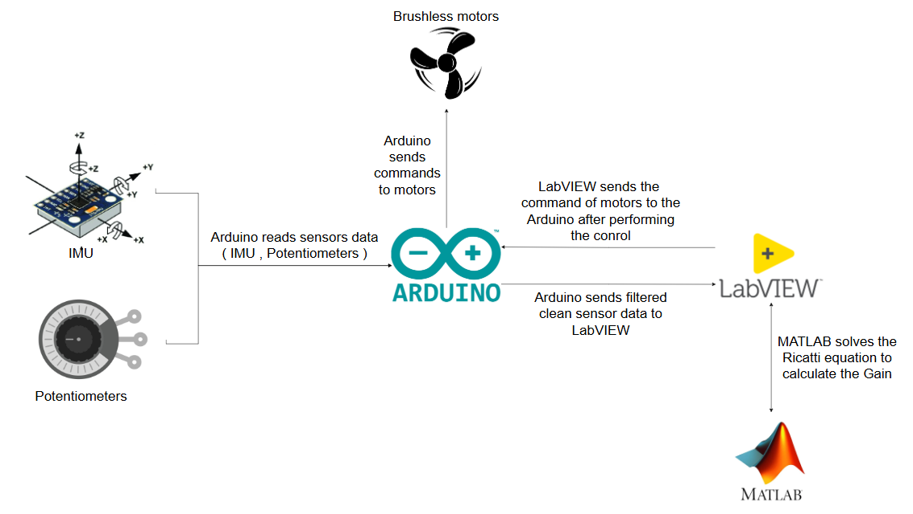

## System Overview
This project focuses on Vertical Take-Off and Landing (VTOL) systems, integrating advanced control systems to manage the complexities of nonlinear dynamics in flight. The system is tailored for applications in both commercial and research environments, leveraging robust embedded programming techniques to ensure reliable operation.

# Architecture

# Control Strategy

The control strategy focuses on managing the state and behavior of the VTOL system. This involves real-time data analysis, control logic, and system feedback mechanisms aligned with the design specifications depicted in the architecture diagram.

# Demo Video

The demo video showcases the implemented control systems, highlighting the nonlinear dynamics handled by the system. It also emphasizes the embedded programming techniques utilized for system integrations. The video includes demonstrations of LabVIEW programming for real-time monitoring and control, emphasizing how these technologies contribute to the effective operation of vertical take-off and landing capabilities.
